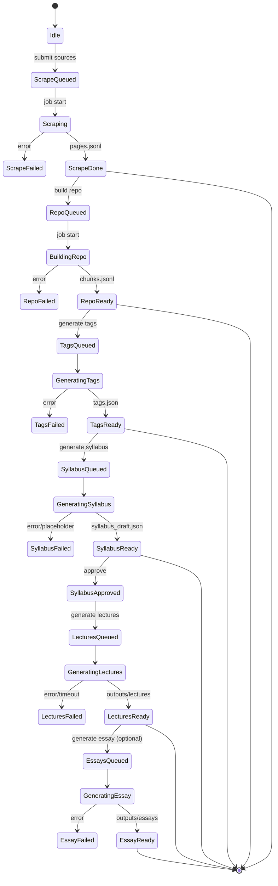

# SelfStudy App Overview

This document provides a concise primer on the SelfStudy pipeline, data model, and runtime behavior. It is intended as a quick orientation for contributors and operators.

## What the App Does

SelfStudy turns a small set of sources into a structured learning product:

1) Scrapes sources (single URLs, indexes, sitemaps).
2) Builds a local repository of pages and chunks.
3) Generates a topic taxonomy (tags).
4) Generates a syllabus (lecture plan).
5) Generates full lectures (and optional essays) using RAG.

The system is designed to be reproducible: all artifacts are stored per project under `projects/<project_id>/`.

## Key Concepts

- **Project**: A unit of work identified by `project_id`. All inputs/outputs live in `projects/<project_id>/`.
- **Sources**: URL list + crawl mode and limits stored in `sources.json`.
- **Repo**: Structured store of scraped pages and chunks (`repo/pages.jsonl`, `repo/chunks.jsonl`).
- **Tags**: Top-level taxonomy from LLM (`tags.json`).
- **Syllabus**: Lecture plan with titles, summaries, objectives, key terms, sources.
- **Lectures**: Generated long-form content in `outputs/lectures`.

## Pipeline Stages

1) **Scrape**
   - Inputs: `sources.json`
   - Outputs: `repo/pages.jsonl`, cache, and scrape summary

2) **Repo Build**
   - Inputs: `repo/pages.jsonl`
   - Outputs: `repo/chunks.jsonl`

3) **Tag Generation**
   - Inputs: sampled or retrieved repo content
   - Outputs: `tags.json`

4) **Syllabus Generation**
   - Inputs: tags, tag weights, top-K relevant chunks (RAG)
   - Outputs: `syllabus_draft.json`
   - Repair: placeholder detection and targeted regeneration

5) **Lecture Generation**
   - Inputs: approved syllabus + per-lecture top-K relevant chunks
   - Outputs: `outputs/lectures/*.md`

6) **Essay Generation** (optional)
   - Inputs: topic + top-K relevant chunks
   - Outputs: `outputs/essays/*.md`

## RAG Strategy (Current)

- **Syllabus**: Builds context from top-K chunks by tag relevance (keyword-weighted).
- **Lectures**: Retrieves top-K chunks per lecture based on focus tags.
- **Retrieval**: Simple keyword scoring, no embeddings (embeddings are gated).

## Placeholder Protection

The system detects template placeholders and repairs:

- Placeholder detection: generic summaries, placeholder objectives, `term1..term5`, empty sources.
- Repair: full-syllabus repair pass using OpenAI.
- Targeted regeneration: if placeholders remain, regenerate only bad lectures with focused context.
- Fail-fast: if placeholders still exist after targeted regeneration, the job fails.

## Jobs & Status

Job records are stored in `projects/metadata.db` (table `job`).
The UI polls `/jobs/{job_id}` and reads job messages/progress.

Recent improvements:
- Heartbeat updates for long-running lecture generation.
- Per-lecture progress messages (e.g., "Lecture 7/12 generated").

## Config (Key Settings)

Defined in `apps/api/app/config.py`:

- `llm_provider`, `openai_api_key`, `openai_model`
- `dspy_enabled`, `dspy_max_revisions`
- `syllabus_context_chunks` (top-K for syllabus)
- `lecture_chunk_parts`, `lecture_chunk_overhead_words`
- `lecture_target_words`, min/max, expansion rounds

## State Machine Diagram



## File Layout (Per Project)

```
projects/<project_id>/
  sources.json
  repo/
    pages.jsonl
    chunks.jsonl
  tags.json
  syllabus_draft.json
  syllabus_approved.json
  outputs/
    lectures/
    essays/
  runs/
  cache/
```

## Typical Failure Modes

- **Placeholder syllabus**: model returns generic lectures; now auto-repaired or fails.
- **Lecture stalls**: long LLM calls without timeouts; heartbeat mitigates UI uncertainty.
- **Scrape DNS errors**: isolated worker lacks DNS; verify environment networking.

## Recommended Operator Checks

1) Verify `OPENAI_API_KEY` is present in the API environment.
2) Ensure scrape workers have DNS/network access.
3) Inspect `projects/<id>/runs/*.json` for model metadata and prompts.
4) If placeholders appear, check tag quality and source breadth.

